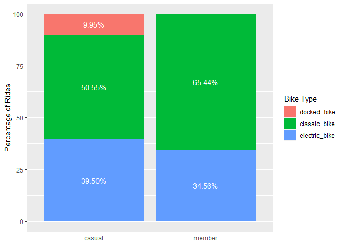
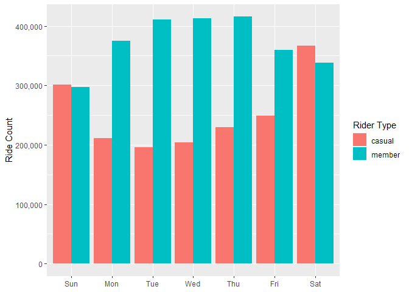

Cyclistic 2022 Case Study
================
Leopoldine Mirtil

### Disclaimer

This analysis was made from the *Cyclistic Bike Share Case Study: How
Does a Bike-Share Navigate Speedy Success?* offered through the Google
Data Analytics Certificate program on Coursera.com. The data has been
made publicly available by the Motivate International Inc license. The
data was originally downloaded from the 2022 monthly [Divvy trip
dataset](https://divvy-tripdata.s3.amazonaws.com/index.html).

## Introduction

### Scenario

You are a junior data analyst working in the marketing analyst team at
Cyclistic, a bike-share company in Chicago. The director of marketing
believes the company’s future success depends on maximizing the number
of annual memberships. Therefore, your team wants to understand how
casual riders and annual members use Cyclistic bikes differently. From
these insights, your team will design a new marketing strategy to
convert casual riders into annual members. But first, Cyclistic
executives must approve your recommendations, so they must be backed up
with compelling data insights and professional data visualizations.

### Task

1.  How do annual members and casual riders use Cyclistic bikes
    differently?
2.  Why would casual riders buy Cyclistic annual memberships?
3.  How can Cyclistic use digital media to influence casual riders to
    become members?

## Let’s Get to Work

### Step 1 - Import Data

#### Load Packages

``` r
#for data manipulation
library(dplyr)
library(lubridate)
library(tidyr)
library(tidyverse)

#for visualizations
library(ggplot2)

#for documentation/markdown
library(knitr)
```

#### Import Data Files

``` r
setwd("C:/Users/Leopoldine/Desktop/Mine/Coding Projects & Portfolio/Cyclistic Case Study/Cyclistic2022/00_raw_data")

m1_2022 <- read.csv("202201-divvy-tripdata.csv")
m2_2022 <- read.csv("202202-divvy-tripdata.csv")
m3_2022 <- read.csv("202203-divvy-tripdata.csv")
m4_2022 <- read.csv("202204-divvy-tripdata.csv")
m5_2022 <- read.csv("202205-divvy-tripdata.csv")
m6_2022 <- read.csv("202206-divvy-tripdata.csv")
m7_2022 <- read.csv("202207-divvy-tripdata.csv")
m8_2022 <- read.csv("202208-divvy-tripdata.csv")
m9_2022 <- read.csv("202209-divvy-publictripdata.csv")
m10_2022 <- read.csv("202210-divvy-tripdata.csv")
m11_2022 <- read.csv("202211-divvy-tripdata.csv")
m12_2022 <- read.csv("202212-divvy-tripdata.csv")
```

### Step 2 - Merge Data Sets

``` r
#combine all files
total_trips <- bind_rows(m1_2022, m2_2022, m3_2022, m4_2022, m5_2022, m6_2022, m7_2022, m8_2022, m9_2022, m10_2022, m11_2022, m12_2022)

#inspect new data frame
str(total_trips)  
```

    ## 'data.frame':    5667717 obs. of  13 variables:
    ##  $ ride_id           : chr  "C2F7DD78E82EC875" "A6CF8980A652D272" "BD0F91DFF741C66D" "CBB80ED419105406" ...
    ##  $ rideable_type     : chr  "electric_bike" "electric_bike" "classic_bike" "classic_bike" ...
    ##  $ started_at        : chr  "2022-01-13 11:59:47" "2022-01-10 08:41:56" "2022-01-25 04:53:40" "2022-01-04 00:18:04" ...
    ##  $ ended_at          : chr  "2022-01-13 12:02:44" "2022-01-10 08:46:17" "2022-01-25 04:58:01" "2022-01-04 00:33:00" ...
    ##  $ start_station_name: chr  "Glenwood Ave & Touhy Ave" "Glenwood Ave & Touhy Ave" "Sheffield Ave & Fullerton Ave" "Clark St & Bryn Mawr Ave" ...
    ##  $ start_station_id  : chr  "525" "525" "TA1306000016" "KA1504000151" ...
    ##  $ end_station_name  : chr  "Clark St & Touhy Ave" "Clark St & Touhy Ave" "Greenview Ave & Fullerton Ave" "Paulina St & Montrose Ave" ...
    ##  $ end_station_id    : chr  "RP-007" "RP-007" "TA1307000001" "TA1309000021" ...
    ##  $ start_lat         : num  42 42 41.9 42 41.9 ...
    ##  $ start_lng         : num  -87.7 -87.7 -87.7 -87.7 -87.6 ...
    ##  $ end_lat           : num  42 42 41.9 42 41.9 ...
    ##  $ end_lng           : num  -87.7 -87.7 -87.7 -87.7 -87.6 ...
    ##  $ member_casual     : chr  "casual" "casual" "member" "casual" ...

### Step 3 - Add New Columns

``` r
#get initial date riders got the bikes and for later use 
total_trips$date <- as.Date(total_trips$started_at) 

#month of start date to identify patterns and trends
total_trips$month <- format(as.Date(total_trips$date), "%m")  

#full weekday name of the date(Sunday, Saturday...)
total_trips$day_of_week <- format(as.Date(total_trips$date), "%A")  

#rental duration in seconds
total_trips$duration <- difftime(total_trips$ended_at,total_trips$started_at) 
```

### Step 4 - Cleaning Process

#### Inspect Modified Data Frame

``` r
str(total_trips) 
```

    ## 'data.frame':    5667717 obs. of  17 variables:
    ##  $ ride_id           : chr  "C2F7DD78E82EC875" "A6CF8980A652D272" "BD0F91DFF741C66D" "CBB80ED419105406" ...
    ##  $ rideable_type     : chr  "electric_bike" "electric_bike" "classic_bike" "classic_bike" ...
    ##  $ started_at        : chr  "2022-01-13 11:59:47" "2022-01-10 08:41:56" "2022-01-25 04:53:40" "2022-01-04 00:18:04" ...
    ##  $ ended_at          : chr  "2022-01-13 12:02:44" "2022-01-10 08:46:17" "2022-01-25 04:58:01" "2022-01-04 00:33:00" ...
    ##  $ start_station_name: chr  "Glenwood Ave & Touhy Ave" "Glenwood Ave & Touhy Ave" "Sheffield Ave & Fullerton Ave" "Clark St & Bryn Mawr Ave" ...
    ##  $ start_station_id  : chr  "525" "525" "TA1306000016" "KA1504000151" ...
    ##  $ end_station_name  : chr  "Clark St & Touhy Ave" "Clark St & Touhy Ave" "Greenview Ave & Fullerton Ave" "Paulina St & Montrose Ave" ...
    ##  $ end_station_id    : chr  "RP-007" "RP-007" "TA1307000001" "TA1309000021" ...
    ##  $ start_lat         : num  42 42 41.9 42 41.9 ...
    ##  $ start_lng         : num  -87.7 -87.7 -87.7 -87.7 -87.6 ...
    ##  $ end_lat           : num  42 42 41.9 42 41.9 ...
    ##  $ end_lng           : num  -87.7 -87.7 -87.7 -87.7 -87.6 ...
    ##  $ member_casual     : chr  "casual" "casual" "member" "casual" ...
    ##  $ date              : Date, format: "2022-01-13" "2022-01-10" ...
    ##  $ month             : chr  "01" "01" "01" "01" ...
    ##  $ day_of_week       : chr  "Thursday" "Monday" "Tuesday" "Tuesday" ...
    ##  $ duration          : 'difftime' num  177 261 261 896 ...
    ##   ..- attr(*, "units")= chr "secs"

#### Change Data Type of Column

``` r
#copy data before further modifications
total_tripsv2 <- total_trips

#convert to numeric data type & remove 'secs' unit
total_tripsv2$duration <- as.numeric(total_tripsv2$duration)

# confirm data type change
str(total_tripsv2$duration)
```

    ##  num [1:5667717] 177 261 261 896 362 ...

#### Remove Negative Values

``` r
total_tripsv2 <- total_tripsv2[!(total_tripsv2$duration<0),]
```

#### Remove Unneeded Columns

``` r
#remove 6 columns: both station Id, lat & long 
total_tripsv2 <- total_tripsv2[-c(6, 8:12)] 
```

#### Rename Columns

``` r
total_tripsv2 <- rename(total_tripsv2, bike_type=rideable_type, rider_type=member_casual)
```

#### Check for Missing & Blank Values

``` r
#location & count of any missing/NA values
sapply(total_tripsv2, function(x) sum(is.na(x)))
```

    ##            ride_id          bike_type         started_at           ended_at 
    ##                  0                  0                  0                  0 
    ## start_station_name   end_station_name         rider_type               date 
    ##                  0                  0                  0                  0 
    ##              month        day_of_week           duration 
    ##                  0                  0                  0

``` r
#location & count of blank cells 
sapply(total_tripsv2, function(x) sum(x==""))
```

    ##            ride_id          bike_type         started_at           ended_at 
    ##                  0                  0                  0                  0 
    ## start_station_name   end_station_name         rider_type               date 
    ##             833041             892726                  0                 NA 
    ##              month        day_of_week           duration 
    ##                  0                  0                  0

#### Remove Empty Rows

``` r
total_tripsv2 <- total_tripsv2[!(total_tripsv2$start_station_name %in% ""),]
total_tripsv2 <- total_tripsv2[!(total_tripsv2$end_station_name %in% ""),]
```

``` r
#confirm no more empty rows
sapply(total_tripsv2, function(x) sum(x==""))
```

    ##            ride_id          bike_type         started_at           ended_at 
    ##                  0                  0                  0                  0 
    ## start_station_name   end_station_name         rider_type               date 
    ##                  0                  0                  0                 NA 
    ##              month        day_of_week           duration 
    ##                  0                  0                  0

#### Inspect Final, Modified Data Frame

``` r
str(total_tripsv2) 
```

    ## 'data.frame':    4369291 obs. of  11 variables:
    ##  $ ride_id           : chr  "C2F7DD78E82EC875" "A6CF8980A652D272" "BD0F91DFF741C66D" "CBB80ED419105406" ...
    ##  $ bike_type         : chr  "electric_bike" "electric_bike" "classic_bike" "classic_bike" ...
    ##  $ started_at        : chr  "2022-01-13 11:59:47" "2022-01-10 08:41:56" "2022-01-25 04:53:40" "2022-01-04 00:18:04" ...
    ##  $ ended_at          : chr  "2022-01-13 12:02:44" "2022-01-10 08:46:17" "2022-01-25 04:58:01" "2022-01-04 00:33:00" ...
    ##  $ start_station_name: chr  "Glenwood Ave & Touhy Ave" "Glenwood Ave & Touhy Ave" "Sheffield Ave & Fullerton Ave" "Clark St & Bryn Mawr Ave" ...
    ##  $ end_station_name  : chr  "Clark St & Touhy Ave" "Clark St & Touhy Ave" "Greenview Ave & Fullerton Ave" "Paulina St & Montrose Ave" ...
    ##  $ rider_type        : chr  "casual" "casual" "member" "casual" ...
    ##  $ date              : Date, format: "2022-01-13" "2022-01-10" ...
    ##  $ month             : chr  "01" "01" "01" "01" ...
    ##  $ day_of_week       : chr  "Thursday" "Monday" "Tuesday" "Tuesday" ...
    ##  $ duration          : num  177 261 261 896 362 ...

## Descriptive Analysis

#### Summary Duration by Rider Type

``` r
total_tripsv2 %>%                            
  group_by(rider_type) %>%
    summarize(min = min(duration), 
    q1 = quantile(duration, 0.25), 
    median = median(duration), 
    mean = sprintf("%.2f", mean(duration)), 
    q3 = quantile(duration, 0.75), 
    max = max(duration)) 
```

    ## # A tibble: 2 × 7
    ##   rider_type   min    q1 median mean       q3     max
    ##   <chr>      <dbl> <dbl>  <dbl> <chr>   <dbl>   <dbl>
    ## 1 casual         0   473    831 1439.63  1551 2057644
    ## 2 member         0   315    539 747.12    922   89594

#### Summary Duration by Rider & Bike Types

``` r
total_tripsv2 %>%                            
  group_by(rider_type, bike_type) %>%
    summarize(min = min(duration), 
    q1 = quantile(duration, 0.25), 
    median = median(duration), 
    mean = sprintf("%.2f", mean(duration)),  
    q3 = quantile(duration, 0.75), 
    max = max(duration))
```

    ## # A tibble: 5 × 8
    ## # Groups:   rider_type [2]
    ##   rider_type bike_type       min    q1 median mean       q3     max
    ##   <chr>      <chr>         <dbl> <dbl>  <dbl> <chr>   <dbl>   <dbl>
    ## 1 casual     classic_bike      0   502    871 1466.83  1599   89965
    ## 2 casual     docked_bike       0   958   1663 3042.53  3199 2057644
    ## 3 casual     electric_bike     0   402    674 1001.28  1182   28795
    ## 4 member     classic_bike      0   325    563 794.05    986   89594
    ## 5 member     electric_bike     0   297    498 658.29    817   28800

#### Total Trip Count by Rider Type

``` r
total_tripsv2 %>% count(rider_type, sort = TRUE)
```

    ##   rider_type       n
    ## 1     member 2611141
    ## 2     casual 1758150

#### Total Trip Count by Bike Type

``` r
total_tripsv2 %>% count(bike_type, sort = TRUE)
```

    ##       bike_type       n
    ## 1  classic_bike 2597398
    ## 2 electric_bike 1597035
    ## 3   docked_bike  174858

#### Total Trip Count by Bike & Rider Types

``` r
total_tripsv2 %>% count(bike_type, rider_type, sort = TRUE)
```

    ##       bike_type rider_type       n
    ## 1  classic_bike     member 1708634
    ## 2 electric_bike     member  902507
    ## 3  classic_bike     casual  888764
    ## 4 electric_bike     casual  694528
    ## 5   docked_bike     casual  174858

#### Total Weekday Ride Count by Rider Type

``` r
total_tripsv2$day_of_week <- ordered(total_tripsv2$day_of_week, levels=c("Sunday", "Monday", "Tuesday", "Wednesday", "Thursday", "Friday", "Saturday"))
total_tripsv2 %>%                            
  group_by(rider_type, day_of_week) %>%
    summarize(number_of_rides = n()) %>%
    arrange(day_of_week, rider_type) 
```

    ## # A tibble: 14 × 3
    ## # Groups:   rider_type [2]
    ##    rider_type day_of_week number_of_rides
    ##    <chr>      <ord>                 <int>
    ##  1 casual     Sunday               301296
    ##  2 member     Sunday               297722
    ##  3 casual     Monday               210757
    ##  4 member     Monday               375168
    ##  5 casual     Tuesday              196380
    ##  6 member     Tuesday              411244
    ##  7 casual     Wednesday            203576
    ##  8 member     Wednesday            412794
    ##  9 casual     Thursday             230005
    ## 10 member     Thursday             415887
    ## 11 casual     Friday               248796
    ## 12 member     Friday               360053
    ## 13 casual     Saturday             367340
    ## 14 member     Saturday             338273

#### Average Weekday Ride Duration by Rider Type

``` r
total_tripsv2$day_of_week <- ordered(total_tripsv2$day_of_week, levels=c("Sunday", "Monday", "Tuesday", "Wednesday", "Thursday", "Friday", "Saturday"))
total_tripsv2 %>%                            
  group_by(rider_type, day_of_week) %>%
    summarise(average_duration = sprintf("%.2f", mean(duration))) %>%
    arrange(day_of_week, rider_type) 
```

    ## # A tibble: 14 × 3
    ## # Groups:   rider_type [2]
    ##    rider_type day_of_week average_duration
    ##    <chr>      <ord>       <chr>           
    ##  1 casual     Sunday      1634.00         
    ##  2 member     Sunday      831.26          
    ##  3 casual     Monday      1490.05         
    ##  4 member     Monday      721.97          
    ##  5 casual     Tuesday     1286.52         
    ##  6 member     Tuesday     707.47          
    ##  7 casual     Wednesday   1243.08         
    ##  8 member     Wednesday   710.81          
    ##  9 casual     Thursday    1284.21         
    ## 10 member     Thursday    721.91          
    ## 11 casual     Friday      1341.43         
    ## 12 member     Friday      733.62          
    ## 13 casual     Saturday    1605.91         
    ## 14 member     Saturday    838.85

#### Total Monthly Number of Rides by Rider Type

``` r
total_tripsv2 %>%                            
  group_by(rider_type, month) %>%
    summarise(number_of_rides = n()) %>%
    arrange(month, rider_type) %>%
    print(n=24)
```

    ## # A tibble: 24 × 3
    ## # Groups:   rider_type [2]
    ##    rider_type month number_of_rides
    ##    <chr>      <chr>           <int>
    ##  1 casual     01              12605
    ##  2 member     01              67523
    ##  3 casual     02              15144
    ##  4 member     02              74034
    ##  5 casual     03              67154
    ##  6 member     03             148827
    ##  7 casual     04              91897
    ##  8 member     04             180663
    ##  9 casual     05             220246
    ## 10 member     05             282299
    ## 11 casual     06             292067
    ## 12 member     06             328281
    ## 13 casual     07             311670
    ## 14 member     07             330996
    ## 15 casual     08             270089
    ## 16 member     08             335224
    ## 17 casual     09             220913
    ## 18 member     09             314227
    ## 19 casual     10             151324
    ## 20 member     10             262943
    ## 21 casual     11              73536
    ## 22 member     11             182226
    ## 23 casual     12              31505
    ## 24 member     12             103898

#### Top 5 Destinations by Riders

``` r
total_tripsv2 %>%
  group_by(rider_type, end_station_name) %>%
    summarize(number_of_rides = n()) %>%
    arrange(rider_type, desc(number_of_rides)) %>%
    slice(1:5) 
```

    ## # A tibble: 10 × 3
    ## # Groups:   rider_type [2]
    ##    rider_type end_station_name                   number_of_rides
    ##    <chr>      <chr>                                        <int>
    ##  1 casual     Streeter Dr & Grand Ave                      57809
    ##  2 casual     DuSable Lake Shore Dr & Monroe St            28543
    ##  3 casual     Millennium Park                              25675
    ##  4 casual     Michigan Ave & Oak St                        25373
    ##  5 casual     DuSable Lake Shore Dr & North Blvd           25305
    ##  6 member     Kingsbury St & Kinzie St                     23213
    ##  7 member     Clark St & Elm St                            20902
    ##  8 member     Wells St & Concord Ln                        20272
    ##  9 member     Clinton St & Washington Blvd                 19496
    ## 10 member     Clinton St & Madison St                      18520

## Plots and Visualizations

#### Preferred Bikes among Riders

<!-- -->

The classic bike is the most preferred bike with over half of member
riders and about fifty percent of casual riders. The docked bike was
only used by casual riders, but made up a small percentage of their
total ride count.

#### Total Weekday Ride Count

<!-- -->

Annual members consistently had a larger number of rides Monday to
Friday, with the maximum number of rides on occurring on Thursday. On
the weekends, casual riders had a higher number of riders than members,
with the highest amount occurring on Saturday.

#### Average Weekday Trip Duration

<!-- -->

The average ride duration during the week among casual riders was
consistently twice the length of member riders during the week. The
average duration among both rider types is highest on the weekends.
Meanwhile, the average ride duration among annual members was steadily
under 1,000 seconds throughout the week.

#### Total Monthly Ride Count

<!-- -->

Annual members consistently had a higher number of rides across the year
when compared to casual riders. The maximum number of rides occurred in
July for casual riders and in August for members. There is a noticeable
drop in the number of rides after July among casual riders and after
August among annual members. This corresponds with the upcoming fall and
winter seasons. The maximum amount of rides for both rider types occurs
during the spring and summer seasons.

#### Top 5 End Station Destinations

<!-- -->

The top 5 destinations (end stations) among both riders are different
locations. The Streeter Dr & Grand Ave station is the top destination
among casual riders while for member riders it is the Kingsbury St &
Kinzie St station. The numbers are more consistent among members than
casual riders.

### Recommendations

**Increase Classic Bikes**

Replace docked bikes with new classic bikes to bring in more casual
riders. Since the classic bike is the most popular among casual riders,
increasing the amount available at stations will help bring in more
casual riders and convert them to members. This will also have the added
benefit of increasing the available bikes to members as well.

**Membership Specials**

Offer new membership specials that would offer membership to casual
riders at a discount. Since there is a marked increase in the number of
casual riders on the weekend and approaching the summer from May to
July, it would be advantageous to offer Weekend, Spring and Summer
Specials. The company can also show highlight perks of membership
through digital media to influence casual riders to become members. This
can include posting member testimonials and ads highlighting the
benefits of the bike rides (save time or money, enjoy the sites, get in
shape, etc.)

**Advertise Top 5 Destinations**

Use digital media and ads near start stations to advertise the top 5 end
stations used by riders. Since the top 5 destinations of casual riders
differ from those of members, the advertisements will help attract more
casual riders and convert them to membership.
