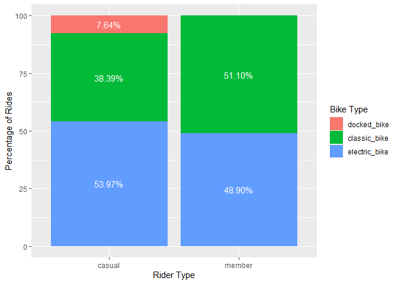
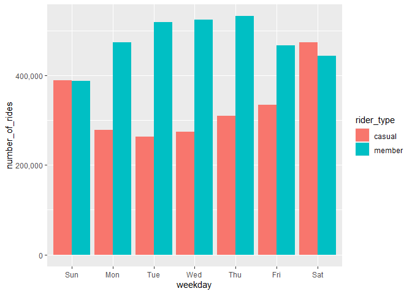
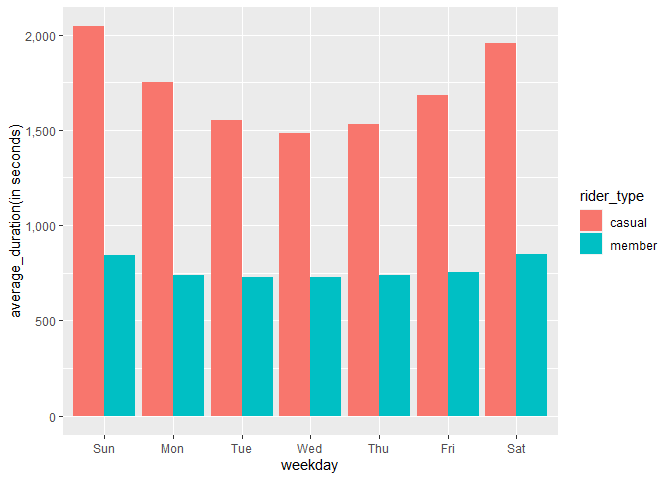
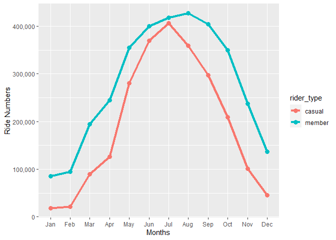
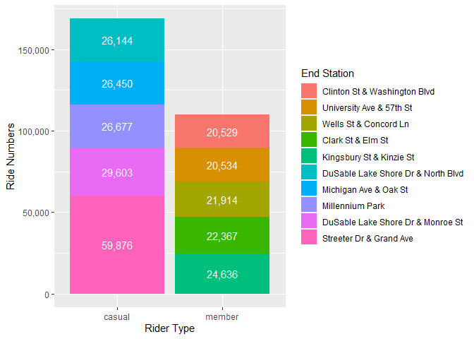

Cyclistic 2022 Case Study
================
Leopoldine Mirtil
2023-09-07

### Disclaimer

This analysis was made from the *Cyclistic Bike Share Case Study: How
Does a Bike-Share Navigate Speedy Success?* offered through the Google
Data Analytics Certificate program on Coursera.com. The data has been
made publicly available by the Motivate International Inc license. The
data was originally downloaded from the 2022 monthly Divvy trip data set
from this [link
here](https://divvy-tripdata.s3.amazonaws.com/index.html).

## Introduction

### Scenario

You are a junior data analyst working in the marketing analyst team at
Cyclistic, a bike-share company in Chicago. The director of marketing
believes the company’s future success depends on maximizing the number
of annual memberships. Therefore, your team wants to understand how
casual riders and annual members use Cyclistic bikes differently. From
these insights, your team will design a new marketing strategy to
convert casual riders into annual members. But first, Cyclistic
executives must approve your recommendations, so they must be backed up
with compelling data insights and professional data visualizations.

### Task

1.  How do annual members and casual riders use Cyclistic bikes
    differently?
2.  Why would casual riders buy Cyclistic annual memberships?
3.  How can Cyclistic use digital media to influence casual riders to
    become members?

## Let’s Get to Work

### Step 1 - Import Data

#### Load Packages

``` r
library(dplyr)
library(ggplot2)
library(knitr)
library(lubridate)
library(tidyr)
library(tidyverse)
```

#### Set Directory and Import Data Files

``` r
setwd("C:/Users/Leopoldine/Desktop/Mine/Coding Projects & Portfolio/Cyclistic Case Study/Cyclistic2022/00_raw_data")

##set the directory first to import files w/o having to include file paths each time
m1_2022 <- read.csv("202201-divvy-tripdata.csv")
m2_2022 <- read.csv("202202-divvy-tripdata.csv")
m3_2022 <- read.csv("202203-divvy-tripdata.csv")
m4_2022 <- read.csv("202204-divvy-tripdata.csv")
m5_2022 <- read.csv("202205-divvy-tripdata.csv")
m6_2022 <- read.csv("202206-divvy-tripdata.csv")
m7_2022 <- read.csv("202207-divvy-tripdata.csv")
m8_2022 <- read.csv("202208-divvy-tripdata.csv")
m9_2022 <- read.csv("202209-divvy-publictripdata.csv")
m10_2022 <- read.csv("202210-divvy-tripdata.csv")
m11_2022 <- read.csv("202211-divvy-tripdata.csv")
m12_2022 <- read.csv("202212-divvy-tripdata.csv")
```

### Step 2 - Combine Data Sets into Single Data Frame

``` r
#combine 12 monthly files into single 2022
total_trips <- bind_rows(m1_2022, m2_2022, m3_2022, m4_2022, m5_2022, m6_2022, m7_2022, m8_2022, m9_2022, m10_2022, m11_2022, m12_2022)

str(total_trips)  #inspect new data frame
```

    ## 'data.frame':    5667717 obs. of  13 variables:
    ##  $ ride_id           : chr  "C2F7DD78E82EC875" "A6CF8980A652D272" "BD0F91DFF741C66D" "CBB80ED419105406" ...
    ##  $ rideable_type     : chr  "electric_bike" "electric_bike" "classic_bike" "classic_bike" ...
    ##  $ started_at        : chr  "2022-01-13 11:59:47" "2022-01-10 08:41:56" "2022-01-25 04:53:40" "2022-01-04 00:18:04" ...
    ##  $ ended_at          : chr  "2022-01-13 12:02:44" "2022-01-10 08:46:17" "2022-01-25 04:58:01" "2022-01-04 00:33:00" ...
    ##  $ start_station_name: chr  "Glenwood Ave & Touhy Ave" "Glenwood Ave & Touhy Ave" "Sheffield Ave & Fullerton Ave" "Clark St & Bryn Mawr Ave" ...
    ##  $ start_station_id  : chr  "525" "525" "TA1306000016" "KA1504000151" ...
    ##  $ end_station_name  : chr  "Clark St & Touhy Ave" "Clark St & Touhy Ave" "Greenview Ave & Fullerton Ave" "Paulina St & Montrose Ave" ...
    ##  $ end_station_id    : chr  "RP-007" "RP-007" "TA1307000001" "TA1309000021" ...
    ##  $ start_lat         : num  42 42 41.9 42 41.9 ...
    ##  $ start_lng         : num  -87.7 -87.7 -87.7 -87.7 -87.6 ...
    ##  $ end_lat           : num  42 42 41.9 42 41.9 ...
    ##  $ end_lng           : num  -87.7 -87.7 -87.7 -87.7 -87.6 ...
    ##  $ member_casual     : chr  "casual" "casual" "member" "casual" ...

#### Set Working Directory and Export File

``` r
setwd("C:/Users/Leopoldine/Desktop/Mine/Coding Projects & Portfolio/Cyclistic Case Study/Cyclistic2022/01_tidy_data")

#export copy of new data frame just in case of sys crash/save corruption or overwrite 
write.csv(total_trips, "total_trips.csv", row.names = FALSE)
```

### Step 3 - Add New Columns

``` r
total_trips$date <- as.Date(total_trips$started_at)  #The default format is yyyy-mm-dd
total_trips$month <- format(as.Date(total_trips$date), "%m")  #month of start date
total_trips$day_of_week <- format(as.Date(total_trips$date), "%A")  #full name of the day of week of start date(Sunday, Saturday)
total_trips$duration <- difftime(total_trips$ended_at,total_trips$started_at)  #ride length in seconds
```

### Step 4 - Cleaning Process

#### Inspect Modified Data Frame

``` r
str(total_trips) 
```

    ## 'data.frame':    5667717 obs. of  17 variables:
    ##  $ ride_id           : chr  "C2F7DD78E82EC875" "A6CF8980A652D272" "BD0F91DFF741C66D" "CBB80ED419105406" ...
    ##  $ rideable_type     : chr  "electric_bike" "electric_bike" "classic_bike" "classic_bike" ...
    ##  $ started_at        : chr  "2022-01-13 11:59:47" "2022-01-10 08:41:56" "2022-01-25 04:53:40" "2022-01-04 00:18:04" ...
    ##  $ ended_at          : chr  "2022-01-13 12:02:44" "2022-01-10 08:46:17" "2022-01-25 04:58:01" "2022-01-04 00:33:00" ...
    ##  $ start_station_name: chr  "Glenwood Ave & Touhy Ave" "Glenwood Ave & Touhy Ave" "Sheffield Ave & Fullerton Ave" "Clark St & Bryn Mawr Ave" ...
    ##  $ start_station_id  : chr  "525" "525" "TA1306000016" "KA1504000151" ...
    ##  $ end_station_name  : chr  "Clark St & Touhy Ave" "Clark St & Touhy Ave" "Greenview Ave & Fullerton Ave" "Paulina St & Montrose Ave" ...
    ##  $ end_station_id    : chr  "RP-007" "RP-007" "TA1307000001" "TA1309000021" ...
    ##  $ start_lat         : num  42 42 41.9 42 41.9 ...
    ##  $ start_lng         : num  -87.7 -87.7 -87.7 -87.7 -87.6 ...
    ##  $ end_lat           : num  42 42 41.9 42 41.9 ...
    ##  $ end_lng           : num  -87.7 -87.7 -87.7 -87.7 -87.6 ...
    ##  $ member_casual     : chr  "casual" "casual" "member" "casual" ...
    ##  $ date              : Date, format: "2022-01-13" "2022-01-10" ...
    ##  $ month             : chr  "01" "01" "01" "01" ...
    ##  $ day_of_week       : chr  "Thursday" "Monday" "Tuesday" "Tuesday" ...
    ##  $ duration          : 'difftime' num  177 261 261 896 ...
    ##   ..- attr(*, "units")= chr "secs"

#### Create New Data Frame and Export File

``` r
setwd("C:/Users/Leopoldine/Desktop/Mine/Coding Projects & Portfolio/Cyclistic Case Study/Cyclistic2022/01_tidy_data")

total_tripsv2 <- total_trips
write.csv(total_tripsv2, "total_tripsv2.csv", row.names = FALSE)
```

#### Change Data Type of Column

``` r
# change data type to remove 'secs' unit and allow for calculations
total_tripsv2$duration <- as.numeric(total_tripsv2$duration)

# confirm data type change
str(total_tripsv2$duration)
```

    ##  num [1:5667717] 177 261 261 896 362 ...

#### Remove Negative Values from ‘duration’ Column

``` r
#remove negative values removed to not affect analysis
total_tripsv2 <- total_tripsv2[!(total_tripsv2$duration<0),]
```

#### Remove Unneeded Columns

``` r
#removing 4 columns: start_lat, start_lng, end_lat, end_lng 
total_tripsv2 <- total_tripsv2[, -9:-12] 
```

#### Rename Columns

``` r
#change names to more appropriate and descriptive names
total_tripsv2 <- rename(total_tripsv2, bike_type=rideable_type, rider_type=member_casual)
```

#### Export Final Modified Data Frame

``` r
setwd("C:/Users/Leopoldine/Desktop/Mine/Coding Projects & Portfolio/Cyclistic Case Study/Cyclistic2022/01_tidy_data")

# export updated data frame
write.csv(total_tripsv2, "total_tripsv2.csv", row.names = FALSE)
```

## Descriptive Analysis

#### Summary Duration by Rider Type

``` r
total_tripsv2 %>%                            
  group_by(rider_type) %>%
    summarize(min = min(duration), 
    q1 = quantile(duration, 0.25), 
    median = median(duration), 
    mean = sprintf("%.2f", mean(duration)), 
    q3 = quantile(duration, 0.75), 
    max = max(duration)) 
```

    ## # A tibble: 2 × 7
    ##   rider_type   min    q1 median mean       q3     max
    ##   <chr>      <dbl> <dbl>  <dbl> <chr>   <dbl>   <dbl>
    ## 1 casual         0   440    780 1748.80  1446 2483235
    ## 2 member         0   307    530 762.86    916   89998

#### Summary Duration by Rider & Bike Types

``` r
total_tripsv2 %>%                            
  group_by(rider_type, bike_type) %>%
    summarize(min = min(duration), 
    q1 = quantile(duration, 0.25), 
    median = median(duration), 
    mean = sprintf("%.2f", mean(duration)),  
    q3 = quantile(duration, 0.75), 
    max = max(duration))
```

    ## # A tibble: 5 × 8
    ## # Groups:   rider_type [2]
    ##   rider_type bike_type       min    q1 median mean       q3     max
    ##   <chr>      <chr>         <dbl> <dbl>  <dbl> <chr>   <dbl>   <dbl>
    ## 1 casual     classic_bike      0   503    873 1725.14  1610   90055
    ## 2 casual     docked_bike       0   966   1683 7362.81  3314 2483235
    ## 3 casual     electric_bike     0   380    656 970.51   1160   28826
    ## 4 member     classic_bike      0   325    564 834.69    987   89998
    ## 5 member     electric_bike     0   289    498 687.79    848   36864

#### Total Trip Count by Rider Type

``` r
total_tripsv2 %>% count(rider_type, sort = TRUE)
```

    ##   rider_type       n
    ## 1     member 3345640
    ## 2     casual 2321977

#### Total Trip Count by Bike Type

``` r
total_tripsv2 %>% count(bike_type, sort = TRUE)
```

    ##       bike_type       n
    ## 1 electric_bike 2888957
    ## 2  classic_bike 2601186
    ## 3   docked_bike  177474

#### Total Trip Count by Bike & Rider Types

``` r
total_tripsv2 %>% count(bike_type, rider_type, sort = TRUE)
```

    ##       bike_type rider_type       n
    ## 1  classic_bike     member 1709743
    ## 2 electric_bike     member 1635897
    ## 3 electric_bike     casual 1253060
    ## 4  classic_bike     casual  891443
    ## 5   docked_bike     casual  177474

#### Total Weekday Ride Count by Rider Type

``` r
total_tripsv2$day_of_week <- ordered(total_tripsv2$day_of_week, levels=c("Sunday", "Monday", "Tuesday", "Wednesday", "Thursday", "Friday", "Saturday"))
total_tripsv2 %>%                            
  group_by(rider_type, day_of_week) %>%
    summarize(number_of_rides = n()) %>%
    arrange(day_of_week, rider_type) 
```

    ## # A tibble: 14 × 3
    ## # Groups:   rider_type [2]
    ##    rider_type day_of_week number_of_rides
    ##    <chr>      <ord>                 <int>
    ##  1 casual     Sunday               389011
    ##  2 member     Sunday               387208
    ##  3 casual     Monday               277671
    ##  4 member     Monday               473335
    ##  5 casual     Tuesday              263731
    ##  6 member     Tuesday              518618
    ##  7 casual     Wednesday            274354
    ##  8 member     Wednesday            523867
    ##  9 casual     Thursday             309327
    ## 10 member     Thursday             532255
    ## 11 casual     Friday               334698
    ## 12 member     Friday               467083
    ## 13 casual     Saturday             473185
    ## 14 member     Saturday             443274

#### Average Weekday Ride Duration by Rider Type

``` r
total_tripsv2$day_of_week <- ordered(total_tripsv2$day_of_week, levels=c("Sunday", "Monday", "Tuesday", "Wednesday", "Thursday", "Friday", "Saturday"))
total_tripsv2 %>%                            
  group_by(rider_type, day_of_week) %>%
    summarise(average_duration = sprintf("%.2f", mean(duration))) %>%
    arrange(day_of_week, rider_type) 
```

    ## # A tibble: 14 × 3
    ## # Groups:   rider_type [2]
    ##    rider_type day_of_week average_duration
    ##    <chr>      <ord>       <chr>           
    ##  1 casual     Sunday      2043.85         
    ##  2 member     Sunday      842.10          
    ##  3 casual     Monday      1751.23         
    ##  4 member     Monday      736.21          
    ##  5 casual     Tuesday     1549.36         
    ##  6 member     Tuesday     727.77          
    ##  7 casual     Wednesday   1485.04         
    ##  8 member     Wednesday   726.29          
    ##  9 casual     Thursday    1532.94         
    ## 10 member     Thursday    737.56          
    ## 11 casual     Friday      1682.67         
    ## 12 member     Friday      751.85          
    ## 13 casual     Saturday    1956.80         
    ## 14 member     Saturday    848.38

#### Total Monthly Number of Rides by Rider Type

``` r
total_tripsv2 %>%                            
  group_by(rider_type, month) %>%
    summarise(number_of_rides = n()) %>%
    arrange(month, rider_type) %>%
    print(n=24)
```

    ## # A tibble: 24 × 3
    ## # Groups:   rider_type [2]
    ##    rider_type month number_of_rides
    ##    <chr>      <chr>           <int>
    ##  1 casual     01              18520
    ##  2 member     01              85250
    ##  3 casual     02              21416
    ##  4 member     02              94193
    ##  5 casual     03              89880
    ##  6 member     03             194160
    ##  7 casual     04             126417
    ##  8 member     04             244832
    ##  9 casual     05             280414
    ## 10 member     05             354443
    ## 11 casual     06             369044
    ## 12 member     06             400148
    ## 13 casual     07             406046
    ## 14 member     07             417426
    ## 15 casual     08             358917
    ## 16 member     08             427000
    ## 17 casual     09             296694
    ## 18 member     09             404636
    ## 19 casual     10             208988
    ## 20 member     10             349693
    ## 21 casual     11             100747
    ## 22 member     11             236947
    ## 23 casual     12              44894
    ## 24 member     12             136912

#### Top 5 Destinations by Riders

``` r
top_5_stations <- total_tripsv2 %>%
  group_by(rider_type, end_station_name) %>%
    summarize(number_of_rides = n()) %>%
    arrange(rider_type, desc(number_of_rides)) %>%
    slice(1:6)
top_5_stations <- top_5_stations[!(is.na(top_5_stations$end_station_name) | top_5_stations$end_station_name==""),]  #remove blank field and values
print(top_5_stations)
```

    ## # A tibble: 10 × 3
    ## # Groups:   rider_type [2]
    ##    rider_type end_station_name                   number_of_rides
    ##    <chr>      <chr>                                        <int>
    ##  1 casual     Streeter Dr & Grand Ave                      59876
    ##  2 casual     DuSable Lake Shore Dr & Monroe St            29603
    ##  3 casual     Millennium Park                              26677
    ##  4 casual     Michigan Ave & Oak St                        26450
    ##  5 casual     DuSable Lake Shore Dr & North Blvd           26144
    ##  6 member     Kingsbury St & Kinzie St                     24636
    ##  7 member     Clark St & Elm St                            22367
    ##  8 member     Wells St & Concord Ln                        21914
    ##  9 member     University Ave & 57th St                     20534
    ## 10 member     Clinton St & Washington Blvd                 20529

## Plots and Visualizations

#### Preferred Bikes among Riders

<!-- -->

The electric bike is the most popular bike among casual riders. The
preferred bike type among annual members is the classic bike, with the
electric bike close behind. The docked bike was only used by casual
riders, but made up a small percentage of their total ride count.

#### Total Weekday Ride Count

<!-- -->

Annual members consistently had a larger number of rides Monday to
Friday, with the maximum number of rides on occurring on Thursday. On
the weekends, casual riders had a higher number of riders than members,
with the highest amount occurring on Saturday.

#### Average Weekday Trip Duration

<!-- -->

The average ride duration during the week among casual riders was
consistently twice the length of member riders during the week. The
average duration among both rider types is highest on the weekends.
Meanwhile, the average ride duration among annual members was steadily
under 1,000 seconds throughout the week.

#### Total Monthly Ride Count

<!-- -->

Annual members consistently had a higher number of rides across the year
when compared to casual riders. The maximum number of rides occurred in
July for casual riders and in August for members. There is a noticeable
drop in the number of rides after July among casual riders and after
August among annual members. This corresponds with the upcoming fall and
winter seasons. The maximum amount of rides for both rider types occurs
during the spring and summer seasons.

#### Top 5 End Station Destinations

<!-- -->

The top 5 destinations (end stations) among both riders are different
locations. The Streeter Dr & Grand Ave station is the top destination
among casual riders while for member riders it is the Clark St & Elm St
station. The number of member rides to the destinations is more
consistent compared to casual riders.

### Recommendations

**Increase Electric Bikes**

Replace docked bikes with new electric bikes to bring in more casual
riders. Since the electric bike is the most popular bike type among
casual riders, increasing the amount available at stations will help
bring in more casual riders and convert them to members.This would
benefit current annual members as this would increase the number of
available bikes to them as well. The company can advertise the increase
in supply to attract and convert climate-conscious riders into members.

**Membership Specials**

Offer new membership specials that would offer membership to casual
riders at a discount. Since there is a marked increase in the number of
casual riders on the weekend and approaching the summer from May to
July, it would be advantageous to offer Weekend, Spring and Summer
Specials. The company can also show highlight perks of membership
through digital media to influence casual riders to become members. This
can include posting member testimonials and ads highlighting the
benefits of the bike rides (save time or money, enjoy the sites, get in
shape, etc.)

**Advertise Top 5 Destinations**

Use digital media and ads near start stations to advertise the top 5 end
stations used by riders. Since the top 5 destinations of casual riders
differ from those of members, the advertisements will help attract more
casual riders and convert them to membership.
